2014 US Births Analysis
================

``` r
knitr::opts_chunk$set(echo = TRUE, results = 'show', warning = FALSE, message = FALSE)
```

## Housekeeping Tasks

``` r
# clear environment
rm(list = ls())

# packages
myPackages <- c("openintro","tidyverse", "patchwork", "ggthemes", "psych", "corrplot", "GGally", "car", "MASS", "logistf")

# get packages if necessary
#install.packages(myPackages)

# load packages
lapply(myPackages, require, character.only=TRUE)
```

    ## [[1]]
    ## [1] TRUE
    ## 
    ## [[2]]
    ## [1] TRUE
    ## 
    ## [[3]]
    ## [1] TRUE
    ## 
    ## [[4]]
    ## [1] TRUE
    ## 
    ## [[5]]
    ## [1] TRUE
    ## 
    ## [[6]]
    ## [1] TRUE
    ## 
    ## [[7]]
    ## [1] TRUE
    ## 
    ## [[8]]
    ## [1] TRUE
    ## 
    ## [[9]]
    ## [1] TRUE
    ## 
    ## [[10]]
    ## [1] TRUE

``` r
# not necessary, I just don't care for the warnings
options(warn = -1)
```

``` r
births <- openintro::births14
```

## Exploratory Data Analysis

``` r
# find the describe function to be very useful, preferred visually
describe(births)
```

    ##                 vars    n  mean    sd median trimmed   mad   min   max range
    ## fage               1  886 31.13  7.06  31.00   30.86  7.41 15.00 85.00 70.00
    ## mage               2 1000 28.45  5.76  28.00   28.39  5.93 14.00 47.00 33.00
    ## mature*            3 1000  1.84  0.37   2.00    1.93  0.00  1.00  2.00  1.00
    ## weeks              4 1000 38.67  2.56  39.00   38.94  1.48 21.00 46.00 25.00
    ## premie*            5 1000  1.12  0.33   1.00    1.03  0.00  1.00  2.00  1.00
    ## visits             6  944 11.35  4.11  12.00   11.40  2.97  0.00 30.00 30.00
    ## gained             7  958 30.43 15.24  30.00   29.66 13.34  0.00 98.00 98.00
    ## weight             8 1000  7.20  1.31   7.31    7.28  1.11  0.75 10.62  9.87
    ## lowbirthweight*    9 1000  1.92  0.27   2.00    2.00  0.00  1.00  2.00  1.00
    ## sex*              10 1000  1.50  0.50   2.00    1.51  0.00  1.00  2.00  1.00
    ## habit*            11  981  1.12  0.32   1.00    1.02  0.00  1.00  2.00  1.00
    ## marital*          12 1000  1.41  0.49   1.00    1.38  0.00  1.00  2.00  1.00
    ## whitemom*         13 1000  1.76  0.42   2.00    1.83  0.00  1.00  2.00  1.00
    ##                  skew kurtosis   se
    ## fage             0.80     3.65 0.24
    ## mage             0.11    -0.62 0.18
    ## mature*         -1.86     1.47 0.01
    ## weeks           -1.92     8.13 0.08
    ## premie*          2.28     3.19 0.01
    ## visits           0.09     2.03 0.13
    ## gained           0.80     1.98 0.49
    ## weight          -1.00     2.80 0.04
    ## lowbirthweight* -3.07     7.41 0.01
    ## sex*            -0.02    -2.00 0.02
    ## habit*           2.39     3.72 0.01
    ## marital*         0.38    -1.86 0.02
    ## whitemom*       -1.25    -0.44 0.01

``` r
# since it doesnt make NAs clear though:
sum(is.na((births))) # know I have 231 missing values
```

    ## [1] 231

``` r
births[!complete.cases(births), ] # returns 206 rows, so at least 2 missing values
```

    ## # A tibble: 206 × 13
    ##     fage  mage mature     weeks premie visits gained weight lowbirthweight sex  
    ##    <int> <dbl> <chr>      <dbl> <chr>   <dbl>  <dbl>  <dbl> <chr>          <chr>
    ##  1    NA    16 younger m…    38 full …     NA     29   6.19 not low        male 
    ##  2    28    31 younger m…    39 full …     15     NA   8.2  not low        male 
    ##  3    32    29 younger m…    40 full …     15     NA   8.54 not low        fema…
    ##  4    29    23 younger m…    41 full …     NA     20   8.31 not low        fema…
    ##  5    NA    32 younger m…    40 full …      2     35   6.96 not low        male 
    ##  6    32    36 mature mom    39 full …     NA     36   6.94 not low        fema…
    ##  7    NA    33 younger m…    40 full …     17     12   6.93 not low        male 
    ##  8    32    26 younger m…    40 full …     NA     23   7.72 not low        fema…
    ##  9    NA    22 younger m…    37 full …      0      7   5.44 low            male 
    ## 10    NA    25 younger m…    40 full …     10     34   7.97 not low        fema…
    ## # ℹ 196 more rows
    ## # ℹ 3 more variables: habit <chr>, marital <chr>, whitemom <chr>

``` r
missingValues <- as.data.frame(colSums(is.na(births)))
missingValues %>%
  filter(`colSums(is.na(births))` > 0)
```

    ##        colSums(is.na(births))
    ## fage                      114
    ## visits                     56
    ## gained                     42
    ## habit                      19

### Encoding of Variables

- categorical: mature, premie, lowbirthweight, sex, habit, marital,
  whitemom

- interval: weeks

- ratio: fage, mage, visits, gained, weight

### Missing Values Observations:

- Father’s age accounts for ~49% of our missing data

- Visits to the hospital account for ~24%

- Weight Gained by the mother is ~18%

- Smoking Habit covers ~8%

``` r
# handle factoring
factoringCols <- c("mature", "premie", "lowbirthweight", "sex", "habit", "marital", "whitemom")
births[factoringCols] <- lapply(births[factoringCols], factor)
sapply(births, class)
```

    ##           fage           mage         mature          weeks         premie 
    ##      "integer"      "numeric"       "factor"      "numeric"       "factor" 
    ##         visits         gained         weight lowbirthweight            sex 
    ##      "numeric"      "numeric"      "numeric"       "factor"       "factor" 
    ##          habit        marital       whitemom 
    ##       "factor"       "factor"       "factor"

``` r
# cleaning of NAs
birthsCleaned <- births %>%
  drop_na()

str(birthsCleaned)
```

    ## tibble [794 × 13] (S3: tbl_df/tbl/data.frame)
    ##  $ fage          : int [1:794] 34 36 37 32 32 37 29 30 29 30 ...
    ##  $ mage          : num [1:794] 34 31 36 31 26 36 24 32 26 34 ...
    ##  $ mature        : Factor w/ 2 levels "mature mom","younger mom": 2 2 1 2 2 1 2 2 2 2 ...
    ##  $ weeks         : num [1:794] 37 41 37 36 39 36 40 39 39 42 ...
    ##  $ premie        : Factor w/ 2 levels "full term","premie": 1 1 1 2 1 2 1 1 1 1 ...
    ##  $ visits        : num [1:794] 14 12 10 12 14 10 13 15 11 14 ...
    ##  $ gained        : num [1:794] 28 41 28 48 45 20 65 25 22 40 ...
    ##  $ weight        : num [1:794] 6.96 8.86 7.51 6.75 6.69 6.13 6.74 8.94 9.12 8.91 ...
    ##  $ lowbirthweight: Factor w/ 2 levels "low","not low": 2 2 2 2 2 2 2 2 2 2 ...
    ##  $ sex           : Factor w/ 2 levels "female","male": 2 1 1 1 1 1 2 1 2 2 ...
    ##  $ habit         : Factor w/ 2 levels "nonsmoker","smoker": 1 1 1 1 1 1 1 1 1 1 ...
    ##  $ marital       : Factor w/ 2 levels "married","not married": 1 1 1 1 1 1 2 1 2 1 ...
    ##  $ whitemom      : Factor w/ 2 levels "not white","white": 2 2 1 2 2 2 2 2 1 2 ...

``` r
head(birthsCleaned, 5)
```

    ## # A tibble: 5 × 13
    ##    fage  mage mature      weeks premie visits gained weight lowbirthweight sex  
    ##   <int> <dbl> <fct>       <dbl> <fct>   <dbl>  <dbl>  <dbl> <fct>          <fct>
    ## 1    34    34 younger mom    37 full …     14     28   6.96 not low        male 
    ## 2    36    31 younger mom    41 full …     12     41   8.86 not low        fema…
    ## 3    37    36 mature mom     37 full …     10     28   7.51 not low        fema…
    ## 4    32    31 younger mom    36 premie     12     48   6.75 not low        fema…
    ## 5    32    26 younger mom    39 full …     14     45   6.69 not low        fema…
    ## # ℹ 3 more variables: habit <fct>, marital <fct>, whitemom <fct>

``` r
tail(birthsCleaned, 5)
```

    ## # A tibble: 5 × 13
    ##    fage  mage mature      weeks premie visits gained weight lowbirthweight sex  
    ##   <int> <dbl> <fct>       <dbl> <fct>   <dbl>  <dbl>  <dbl> <fct>          <fct>
    ## 1    48    32 younger mom    40 full …      8      8   9    not low        fema…
    ## 2    29    24 younger mom    32 premie      8     33   2.33 low            fema…
    ## 3    37    31 younger mom    38 full …      8     33   5.8  not low        fema…
    ## 4    27    27 younger mom    34 premie      7     25   6.75 not low        fema…
    ## 5    21    17 younger mom    41 full …     12     41   7.13 not low        fema…
    ## # ℹ 3 more variables: habit <fct>, marital <fct>, whitemom <fct>

### Bar Plots for Categorical Data

``` r
table(birthsCleaned$mature) # moms are generally younger
```

    ## 
    ##  mature mom younger mom 
    ##         131         663

``` r
table(birthsCleaned$premie) # babies are usually full term
```

    ## 
    ## full term    premie 
    ##       696        98

``` r
table(birthsCleaned$lowbirthweight) # most are not of low birthweight
```

    ## 
    ##     low not low 
    ##      58     736

``` r
table(birthsCleaned$sex) # sex of the baby is around even
```

    ## 
    ## female   male 
    ##    394    400

``` r
table(birthsCleaned$habit) # most are nonsmokers
```

    ## 
    ## nonsmoker    smoker 
    ##       732        62

``` r
table(birthsCleaned$marital) # most are married at birth but still, around even
```

    ## 
    ##     married not married 
    ##         527         267

``` r
table(birthsCleaned$whitemom) # most participants are white
```

    ## 
    ## not white     white 
    ##       166       628

``` r
# graphing with ggplot
graphMature <- ggplot(birthsCleaned, aes(mature)) + geom_bar(stat = "count") + geom_text(stat = "count", aes(label = after_stat(count)), vjust = 1, size = 2.75)
graphPremie <- ggplot(birthsCleaned, aes(premie)) + geom_bar(stat = "count") + geom_text(stat = "count", aes(label = after_stat(count)), vjust = 1, size = 2.75)
graphLowBW <- ggplot(birthsCleaned, aes(lowbirthweight)) + geom_bar(stat = "count") + geom_text(stat = "count", aes(label = after_stat(count)), vjust = 0.8, size = 2.75)
graphSex <- ggplot(birthsCleaned, aes(sex)) + geom_bar(stat = "count")  + geom_text(stat = "count", aes(label = after_stat(count)), vjust = 1, size = 2.75)
graphHabit <- ggplot(birthsCleaned, aes(habit)) + geom_bar(stat = "count") + geom_text(stat = "count", aes(label = after_stat(count)), vjust = 1, size = 2.75)
graphMarital <- ggplot(birthsCleaned, aes(marital)) + geom_bar(stat = "count")  + geom_text(stat = "count", aes(label = after_stat(count)), vjust = 1, size = 2.75)
graphWhite <- ggplot(birthsCleaned, aes(whitemom)) + geom_bar(stat = "count") + geom_text(stat = "count", aes(label = after_stat(count)), vjust = 1, size = 2.75)

graphMature + graphPremie + graphLowBW + graphSex + graphHabit + graphMarital + graphWhite + plot_layout(ncol = 3) & theme_pander()
```

<!-- -->

Notes: Not too much interesting in these graphs

Potential Later Inquiries: perhaps might find something in further
segmentation like by low birth weight by child sex, mother maturity,
mother race, marital status

### Histograms for Numerical Data

``` r
par(mfrow = c(2, 3), mar = c(3,5,3,5))
hist(birthsCleaned$fage,
  xlab = "Age",
  main = "Father's Age at Birth",
  col = "deepskyblue2"
)
hist(birthsCleaned$mage,
  xlab = "Age",
  main = "Mother's Age at Birth",
  col = "forestgreen"
)
hist(birthsCleaned$weeks,
  xlab = "Weeks",
  main = "Pregnancy in Weeks",
  col = "coral"
)
hist(birthsCleaned$visits,
  xlab = "Visits",
  main = "Hospital Visits \nduring Pregnancy",
  col = "darkgoldenrod"
)
hist(birthsCleaned$gained,
  xlab = "Weight (lbs)",
  main = "Weight Gained by Mother \nduring Pregnancy",
  col = "aquamarine"
)
hist(birthsCleaned$weight,
  xlab = "Weight (lbs)",
  main = "Baby Weight at Birth",
  col = "cadetblue"
)
```

<!-- -->

``` r
par(mfrow = c(4, 2), mar = c(3,5,3,5))
boxplot(birthsCleaned$fage,
  xlab = "Age",
  horizontal = TRUE,
  pch = 16,
  col = "deepskyblue2", 
  main = "Father's Age at Birth"
)
boxplot(birthsCleaned$mage,
  xlab = "Age",
  horizontal = TRUE,
  pch = 16,
  col = "forestgreen", 
  main = "Mother's Age at Birth" # informative title
) 
boxplot(birthsCleaned$weeks,
  xlab = "Weeks",
  horizontal = TRUE,
  pch = 16,
  col = "coral", 
  main = "Pregnancy in Weeks" # informative title
) 
boxplot(birthsCleaned$visits,
  xlab = "Visits",
  horizontal = TRUE,
  pch = 16,
  col = "darkgoldenrod", 
  main = "Hospital Visits \nduring Pregnancy" # informative title
) 
boxplot(birthsCleaned$gained,
  xlab = "Weight (lbs)",
  horizontal = TRUE,
  pch = 16,
  col = "aquamarine", 
  main = "Weight Gained by Mother \nduring Pregnancy" # informative title
) 
boxplot(birthsCleaned$weight,
  xlab = "Weight (lbs)",
  horizontal = TRUE,
  pch = 16,
  col = "cadetblue", 
  main = "Baby Weight at Birth" # informative title
)
```

<!-- -->

Two different ways of expressing similar concepts but I personally feel
the boxplots to be a bit more informative in that it makes our outliers
clearer in context of the lower/upper ranges of “normal” for the
population.

Some observations:

- Appear to be pretty normally distributed with some small skews

  - *Pregnancy in Weeks* is skewed to the left

  - *Weight Gained by Mother during Pregnancy* is skewed to the right.

  - Either way, that means correlations later can be on default of
    Pearson’s

- Fathers tend to be older than mothers

- If they’re an outlier, more likely that the pregnancy will be shorter
  than longer.

- Mothers are more likely to gain more weight than “normal” while babies
  are more likely to have lower weights at birth than “normal”

## Testing

### Random Sampling

``` r
# would strongly prefer to not have to edit my analysis every rerun, thanks
set.seed(42)
# only ~10% to ensure that things remain cool, independence wise
sampleBirths <- birthsCleaned[sample(nrow(birthsCleaned), 79, replace = FALSE), ]
describe(sampleBirths)
```

    ##                 vars  n  mean    sd median trimmed   mad   min  max range  skew
    ## fage               1 79 31.72  6.48  31.00   31.37  5.93 21.00 48.0 27.00  0.52
    ## mage               2 79 29.77  5.09  30.00   29.82  5.93 18.00 42.0 24.00 -0.08
    ## mature*            3 79  1.82  0.38   2.00    1.89  0.00  1.00  2.0  1.00 -1.66
    ## weeks              4 79 38.44  2.37  39.00   38.74  1.48 29.00 44.0 15.00 -1.47
    ## premie*            5 79  1.11  0.32   1.00    1.03  0.00  1.00  2.0  1.00  2.38
    ## visits             6 79 11.24  3.34  12.00   11.20  2.97  0.00 21.0 21.00  0.02
    ## gained             7 79 29.54 13.61  28.00   29.32 11.86  0.00 67.0 67.00  0.23
    ## weight             8 79  7.26  1.17   7.46    7.34  0.90  4.14  9.7  5.56 -0.72
    ## lowbirthweight*    9 79  1.91  0.29   2.00    2.00  0.00  1.00  2.0  1.00 -2.84
    ## sex*              10 79  1.44  0.50   1.00    1.43  0.00  1.00  2.0  1.00  0.23
    ## habit*            11 79  1.06  0.25   1.00    1.00  0.00  1.00  2.0  1.00  3.52
    ## marital*          12 79  1.33  0.47   1.00    1.29  0.00  1.00  2.0  1.00  0.71
    ## whitemom*         13 79  1.68  0.47   2.00    1.72  0.00  1.00  2.0  1.00 -0.77
    ##                 kurtosis   se
    ## fage               -0.08 0.73
    ## mage               -0.47 0.57
    ## mature*             0.76 0.04
    ## weeks               3.27 0.27
    ## premie*             3.73 0.04
    ## visits              1.69 0.38
    ## gained              0.03 1.53
    ## weight              0.38 0.13
    ## lowbirthweight*     6.15 0.03
    ## sex*               -1.97 0.06
    ## habit*             10.52 0.03
    ## marital*           -1.51 0.05
    ## whitemom*          -1.42 0.05

## Correlations

``` r
# take only columns that are numeric, make correlation matrix, round each value to 3 decimal places
corMatrix <- round(cor(sampleBirths[,sapply(sampleBirths,is.numeric)]), 3)
corMatrix
```

    ##          fage   mage  weeks visits gained weight
    ## fage    1.000  0.773  0.055 -0.020 -0.058 -0.033
    ## mage    0.773  1.000  0.123  0.031 -0.052 -0.040
    ## weeks   0.055  0.123  1.000 -0.154 -0.074  0.432
    ## visits -0.020  0.031 -0.154  1.000 -0.219 -0.160
    ## gained -0.058 -0.052 -0.074 -0.219  1.000  0.108
    ## weight -0.033 -0.040  0.432 -0.160  0.108  1.000

No part of me is surprised by the seemingly tight correlation between
mother’s age and father’s age, that is how that usually goes.

Correlation matrix confirms what we would have thought about the
mother’s and father’s age at a moderate-to-strong 0.77. And based on the
graphs, I didn’t fully expect much to come from this in that manner,
everything does look pretty scattered. The baby’s weight and weeks of
pregnancy are the strongest correlation on the board (other than the
obvious of correlation with the same variable), which makes sense as
they’ve had a bit more time to bake in the oven.

Focusing in on the birth weight and the gestation period, we can look at
something like that by smoker status or maternal race.

``` r
ggplot(sampleBirths, aes(x = weeks, y = weight, color = habit)) +
  geom_point(alpha = 0.6) +
  geom_smooth(method = "lm", se = FALSE) +
  theme_pander() +
  labs(title = "Birth Weight vs. Gestation by Smoking Status", 
       x = "Gestation (weeks)", 
       y = "Weight (lbs)")
```

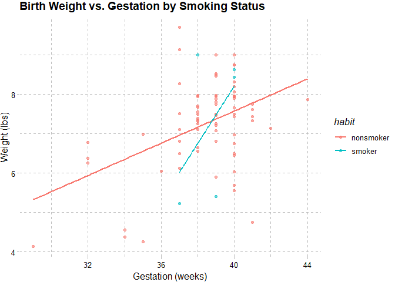<!-- -->

``` r
ggplot(sampleBirths, aes(x = weeks, y = weight, color = whitemom)) +
  geom_point(alpha = 0.6) +
  geom_smooth(method = "lm", se = FALSE) +
  theme_pander() +
  labs(title = "Birth Weight vs. Gestation by Maternal Race", 
       x = "Gestation (weeks)", 
       y = "Weight (lbs)")
```

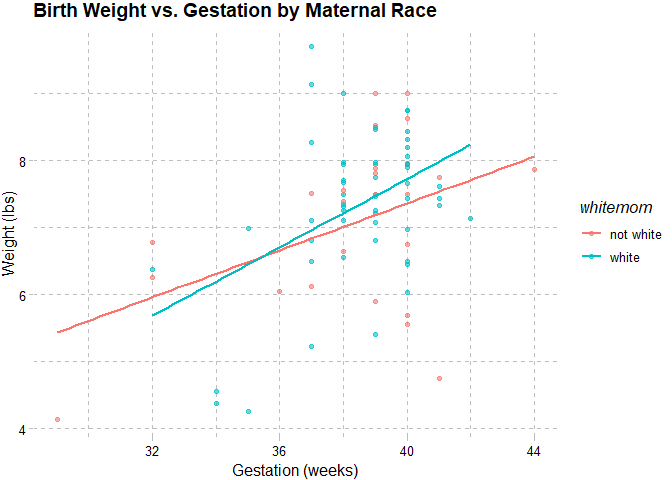<!-- -->

``` r
round(cor(sampleBirths[1:50,sapply(sampleBirths,is.numeric)]), 2)
```

    ##         fage  mage weeks visits gained weight
    ## fage    1.00  0.81 -0.08  -0.07  -0.04  -0.32
    ## mage    0.81  1.00  0.02  -0.02  -0.07  -0.22
    ## weeks  -0.08  0.02  1.00  -0.04   0.04   0.43
    ## visits -0.07 -0.02 -0.04   1.00  -0.35  -0.08
    ## gained -0.04 -0.07  0.04  -0.35   1.00   0.23
    ## weight -0.32 -0.22  0.43  -0.08   0.23   1.00

The second had nothing to do with anything really, it was just
interesting to see how little it takes to change the numbers. While not
by much, mother and father’s ages are more correlated; also the mother’s
weight gained is now more strongly correlated with the baby’s birth
weight.

#### Visualize the correlation matrix

``` r
corrplot(corMatrix, method = 'color', type = "lower", addCoef.col = 'black', tl.col = 'black', number.cex = 0.8)
```

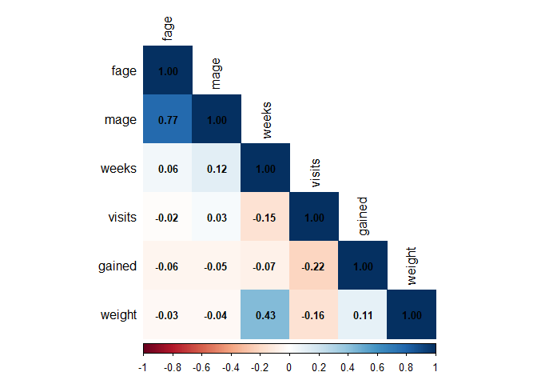<!-- -->

``` r
ggpairs(sampleBirths[,sapply(sampleBirths,is.numeric)],
        upper = list(continuous = 'cor'),
        title = "Pairwise Scatterplots with Correlations")
```

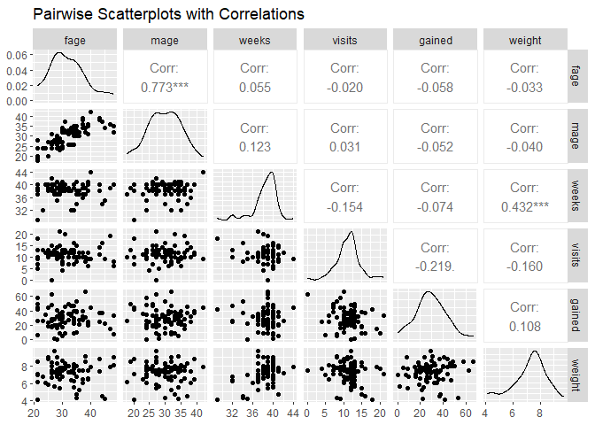<!-- -->

By the graph’s determination, mage/fage, weight/weeks, mother’s weight
gained and baby’s weight at birth were most correlated

`gained` and `weight` (does more maternal weight gain mean heavier
babies?)

``` r
# Scatter plot: gained vs. weight by marital status
ggplot(sampleBirths, aes(x = gained, y = weight, color = marital)) +
  geom_point(alpha = 0.6) +
  geom_smooth(method = "lm", se = FALSE) +
  theme_pander() +
  labs(title = "Maternal Weight Gain vs. Baby Weight by Marital Status",
       x = "Maternal Weight Gain (lbs)",
       y = "Baby Weight (oz)")
```

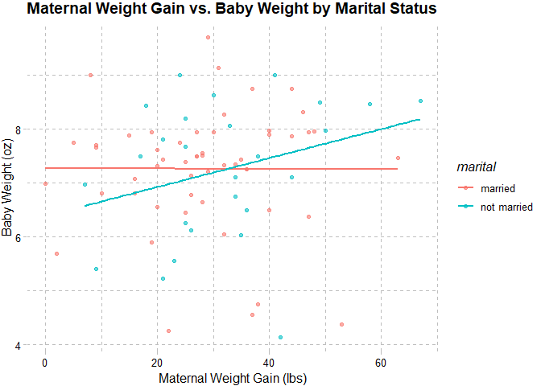<!-- -->

``` r
# by smoker status
ggplot(sampleBirths, aes(x = gained, y = weight, color = habit)) +
  geom_point(alpha = 0.6) +
  geom_smooth(method = "lm", se = FALSE) +
  theme_pander() +
  labs(title = "Maternal Weight Gain vs. Baby Weight by Smoking Habit",
       x = "Maternal Weight Gain (lbs)",
       y = "Baby Weight (oz)")
```

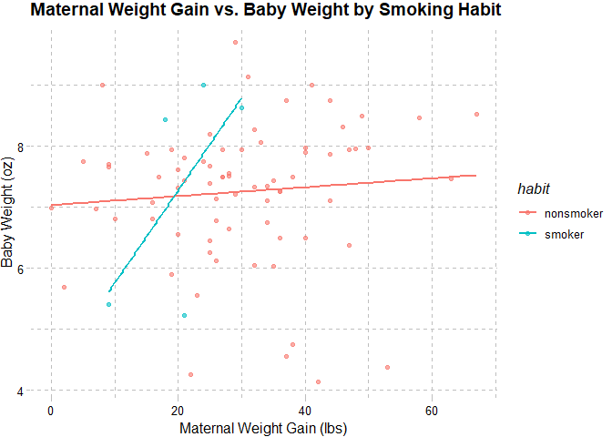<!-- -->

``` r
# by maternal race
ggplot(sampleBirths, aes(x = gained, y = weight, color = whitemom)) +
  geom_point(alpha = 0.6) +
  geom_smooth(method = "lm", se = FALSE) +
  theme_pander() +
  labs(title = "Maternal Weight Gain vs. Baby Weight by Maternal Race", 
       x = "Maternal Weight Gain (lbs)",
       y = "Baby Weight (oz)")
```

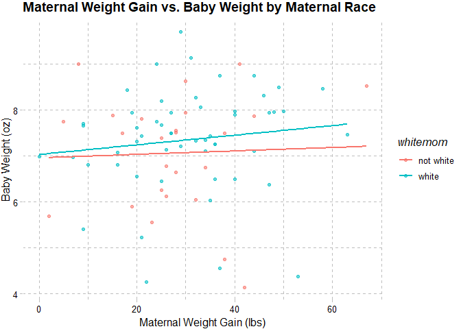<!-- -->

- Appears to be no relationship between baby’s weight at birth and
  mother’s weight when the mother is married but a weak relationship
  between the two when the mother is married.

- As it relates to smoking, there does seem to be a relationship but it
  is far weaker for nonsmokers than smokers.

- The same is true for race, weak for not white moms but slightly
  stronger for white moms.

## Regressions

``` r
levels(sampleBirths$lowbirthweight)
```

    ## [1] "low"     "not low"

### Simple Linear

Going to look at the effects on the baby’s birth weight using a linear
regression model. I will place more in the model but I was more
interested in the weight and weeks connection. Also interested in the
visits.

``` r
modelWeeks <- lm(weight ~ weeks, data = sampleBirths)
summary(modelWeeks)
```

    ## 
    ## Call:
    ## lm(formula = weight ~ weeks, data = sampleBirths)
    ## 
    ## Residuals:
    ##     Min      1Q  Median      3Q     Max 
    ## -3.0521 -0.5685  0.1463  0.5613  2.7491 
    ## 
    ## Coefficients:
    ##             Estimate Std. Error t value Pr(>|t|)    
    ## (Intercept) -0.92241    1.94799  -0.474    0.637    
    ## weeks        0.21279    0.05058   4.207 6.92e-05 ***
    ## ---
    ## Signif. codes:  0 '***' 0.001 '**' 0.01 '*' 0.05 '.' 0.1 ' ' 1
    ## 
    ## Residual standard error: 1.06 on 77 degrees of freedom
    ## Multiple R-squared:  0.1869, Adjusted R-squared:  0.1764 
    ## F-statistic:  17.7 on 1 and 77 DF,  p-value: 6.923e-05

``` r
plot(modelWeeks)
```

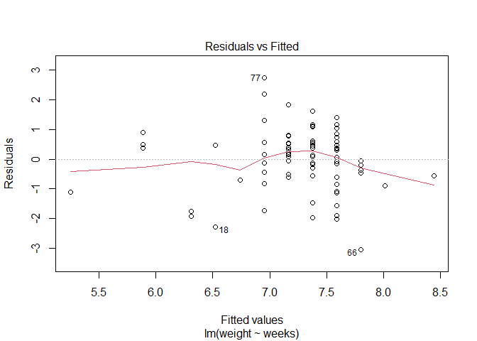<!-- -->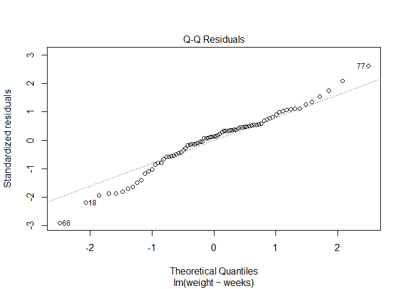<!-- -->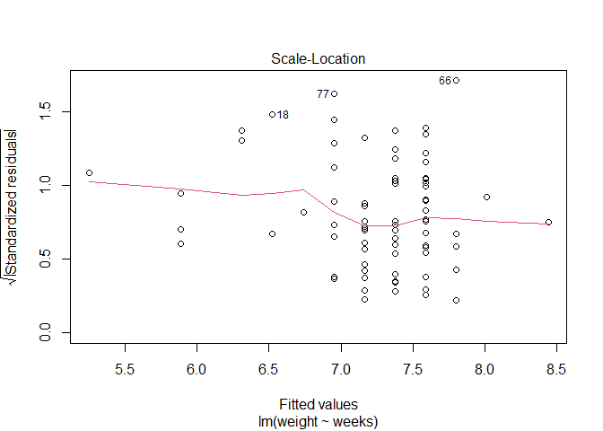<!-- -->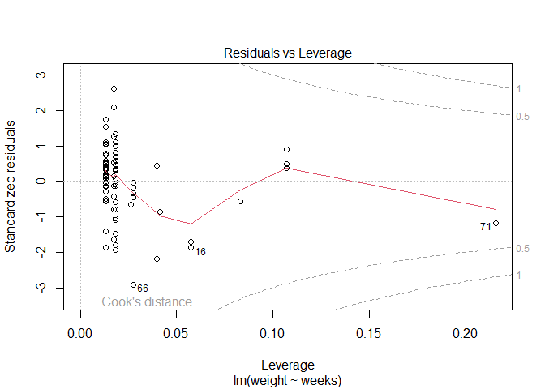<!-- -->

Intercept: when weeks is zero, we predict the baby’s birth weight to be
-0.92 lbs. Considering that birth at zero weeks *should* mean that the
baby has no birth weight, and that birth at this time would be
categorized as a completely different medical event, but is *negative*
makes the output not biologically meaningful. It is also not
statistically significant.

Weeks: We predict that baby’s birth weight to, on average, increase by
0.21 for each week spent gestating. This makes sense as if the baby
stays in for longer, they have more time to grow. This is also indicated
to be statistically significant.

R^2: This value indicates that weeks explains as much as 19% of the
variation.

F-statistic: It is statistically significant overall so gestational
length is a meaningful predictor of birth weight.

Residuals: The prediction is usually around 1lb either direction.

``` r
modelVisits <- lm(weight ~ visits, data = sampleBirths)
summary(modelVisits)
```

    ## 
    ## Call:
    ## lm(formula = weight ~ visits, data = sampleBirths)
    ## 
    ## Residuals:
    ##     Min      1Q  Median      3Q     Max 
    ## -3.1329 -0.6337  0.1829  0.7323  2.4844 
    ## 
    ## Coefficients:
    ##             Estimate Std. Error t value Pr(>|t|)    
    ## (Intercept)  7.88481    0.46065  17.117   <2e-16 ***
    ## visits      -0.05577    0.03930  -1.419     0.16    
    ## ---
    ## Signif. codes:  0 '***' 0.001 '**' 0.01 '*' 0.05 '.' 0.1 ' ' 1
    ## 
    ## Residual standard error: 1.161 on 77 degrees of freedom
    ## Multiple R-squared:  0.02548,    Adjusted R-squared:  0.01283 
    ## F-statistic: 2.013 on 1 and 77 DF,  p-value: 0.1599

The intercept is significant but not all that important to the
interpretation as the number of visits isn’t normally in this social
context but it is possible.

This predictor turned out to be insignificant on its own but if it were,
we’d predict that baby’s birth weight to decrease by 0.05 lbs for each
visit during pregnancy. Additionally it only accounts for 2.5% of the
variation in birth weight which is very weak power.

At zero visits, we predict that the baby’s weight would be 7.88 lbs,
which is a pretty good thing as that is around the mean and is within
weight for full term babies! Nonetheless, while plausible, it isn’t an
indication of being causal.

The residuals here, in context, indicates the error is 1.16 lbs, which
is large compared to an effect size of 0.056 lbs per visit, and may
explain the lack of statistical significance.

### Multiple Linear

Let’s see if there’s anything we can add to weeks to generate a better
result.

``` r
# put everything in
modelMultiple <- lm(weight ~ weeks + gained + mage + fage + visits + mature + premie + lowbirthweight + sex + habit + marital + whitemom, data = sampleBirths)
summary(modelMultiple)
```

    ## 
    ## Call:
    ## lm(formula = weight ~ weeks + gained + mage + fage + visits + 
    ##     mature + premie + lowbirthweight + sex + habit + marital + 
    ##     whitemom, data = sampleBirths)
    ## 
    ## Residuals:
    ##      Min       1Q   Median       3Q      Max 
    ## -1.61059 -0.33484 -0.04365  0.44565  1.81641 
    ## 
    ## Coefficients:
    ##                        Estimate Std. Error t value Pr(>|t|)    
    ## (Intercept)            4.036171   2.552281   1.581  0.11857    
    ## weeks                 -0.001732   0.058214  -0.030  0.97636    
    ## gained                 0.014045   0.006676   2.104  0.03922 *  
    ## mage                  -0.055639   0.029675  -1.875  0.06523 .  
    ## fage                   0.051977   0.020397   2.548  0.01316 *  
    ## visits                 0.002734   0.025771   0.106  0.91584    
    ## matureyounger mom     -0.017358   0.295595  -0.059  0.95335    
    ## premiepremie          -0.749260   0.454679  -1.648  0.10413    
    ## lowbirthweightnot low  2.953123   0.359478   8.215 1.09e-11 ***
    ## sexmale                0.548553   0.176842   3.102  0.00283 ** 
    ## habitsmoker            1.049457   0.408790   2.567  0.01253 *  
    ## maritalnot married    -0.333060   0.216646  -1.537  0.12899    
    ## whitemomwhite          0.085908   0.182804   0.470  0.63994    
    ## ---
    ## Signif. codes:  0 '***' 0.001 '**' 0.01 '*' 0.05 '.' 0.1 ' ' 1
    ## 
    ## Residual standard error: 0.7019 on 66 degrees of freedom
    ## Multiple R-squared:  0.6946, Adjusted R-squared:  0.6391 
    ## F-statistic: 12.51 on 12 and 66 DF,  p-value: 8.664e-13

``` r
plot(modelMultiple)
```

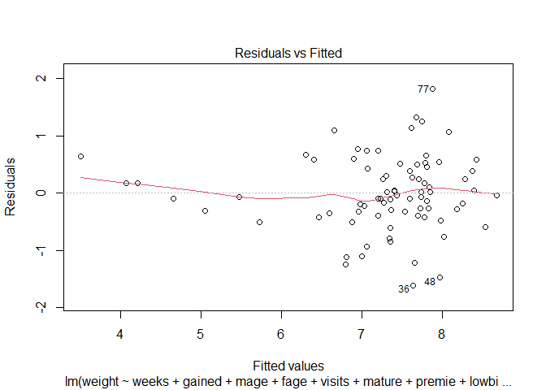<!-- -->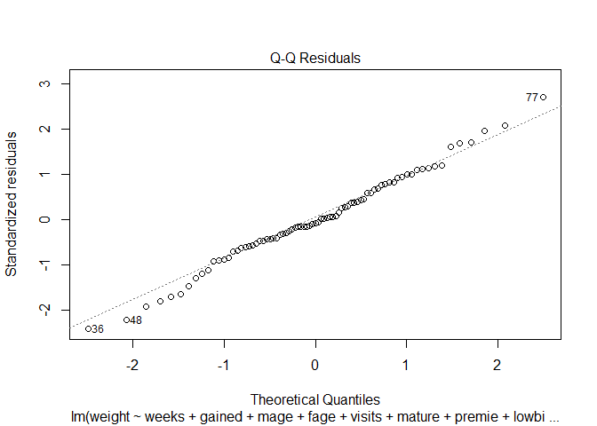<!-- -->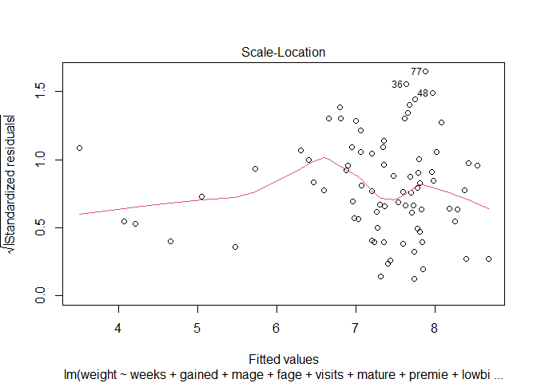<!-- -->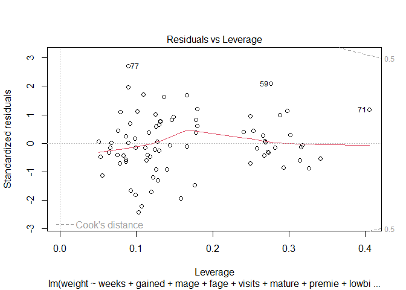<!-- -->

But first, make sure the assumptions are met if we put everything in

``` r
hist(modelMultiple$residuals)
```

<!-- -->

Appears to be normally distributed for the most part, even if somewhat
tailed, which I would think to be fair considering that I did remove all
incomplete data from the beginning and I’m not using the full data set
currently. Appears to be reasonably linear. Already looked at the
correlations and they’re so low that I’m not super concerned about
multicollinearity; however, with consideration to my analysis focusing
on the baby’s birth weight, of course I should reasonably expect that
the value of low birth weight to correlate with the baby’s birth weight
and as a result, it is my first removal from the model once we get to
that point.

``` r
# check for homoscedasticity
breushpaganTest <- ncvTest(modelMultiple)
breushpaganTest
```

    ## Non-constant Variance Score Test 
    ## Variance formula: ~fitted.values 
    ## Chisquare = 0.9752148, Df = 1, p = 0.32338

Using the Breush-Pagan test on the basis of my multiple linear
regression model, the p-value is greater than 0.05 so we’re failing to
reject the null hypothesis and assuming then that the variance of the
residual errors is similar across each independent variable.

We can continue forward.

Due to the fact that the results of the first were likely skewed, to a
degree, by the lowbirthweight variable, this is the new basis for
assessment.

``` r
modelMultiple2 <- lm(weight ~ weeks + gained + mage + fage + visits + mature + premie + sex + habit + marital + whitemom, data = sampleBirths)
summary(modelMultiple2)
```

    ## 
    ## Call:
    ## lm(formula = weight ~ weeks + gained + mage + fage + visits + 
    ##     mature + premie + sex + habit + marital + whitemom, data = sampleBirths)
    ## 
    ## Residuals:
    ##     Min      1Q  Median      3Q     Max 
    ## -2.8560 -0.4881  0.0676  0.5659  1.7737 
    ## 
    ## Coefficients:
    ##                     Estimate Std. Error t value Pr(>|t|)   
    ## (Intercept)         9.222522   3.490600   2.642  0.01025 * 
    ## weeks               0.001066   0.082168   0.013  0.98969   
    ## gained              0.004450   0.009278   0.480  0.63307   
    ## mage               -0.049166   0.041872  -1.174  0.24447   
    ## fage                0.008599   0.027809   0.309  0.75810   
    ## visits             -0.039525   0.035643  -1.109  0.27144   
    ## matureyounger mom  -0.518285   0.408259  -1.270  0.20865   
    ## premiepremie       -1.961287   0.607054  -3.231  0.00191 **
    ## sexmale             0.603325   0.249435   2.419  0.01830 * 
    ## habitsmoker        -0.112342   0.541377  -0.208  0.83624   
    ## maritalnot married -0.381698   0.305682  -1.249  0.21613   
    ## whitemomwhite       0.019872   0.257779   0.077  0.93878   
    ## ---
    ## Signif. codes:  0 '***' 0.001 '**' 0.01 '*' 0.05 '.' 0.1 ' ' 1
    ## 
    ## Residual standard error: 0.9907 on 67 degrees of freedom
    ## Multiple R-squared:  0.3824, Adjusted R-squared:  0.281 
    ## F-statistic: 3.771 on 11 and 67 DF,  p-value: 0.0003191

Intercept: yes.

Weeks: Essentially no effect on birth weight when combined with other
predictors.

Without significant effect: maternal weight gain; maternal age, despite
being slightly negative association; paternal age; younger mothers,
despite weighing slightly less; smoking, marital status of the mother,
race of the mother

Premie: ~1.96 lbs less and is highly significant

Sex of the infant: Males weight ~0.6 lbs more than females and is
significant

This model explains ~38% of the variation in birth weight but adjusted
for the number of predictors, it drops to ~28%. While still
statistically significant, it indicates that there are other factors not
included explain a larger portion of the infant weight variance.

The first model’s summary indicated that we should remove: weeks,
whitemom, habitsmoker, fage, gained and more but we’re starting with
those.

``` r
modelMultiple3 <- lm(weight ~ mage + visits + mature + premie + sex + marital, data = sampleBirths)
summary(modelMultiple3)
```

    ## 
    ## Call:
    ## lm(formula = weight ~ mage + visits + mature + premie + sex + 
    ##     marital, data = sampleBirths)
    ## 
    ## Residuals:
    ##      Min       1Q   Median       3Q      Max 
    ## -2.79119 -0.52096  0.07374  0.62109  1.75460 
    ## 
    ## Coefficients:
    ##                    Estimate Std. Error t value Pr(>|t|)    
    ## (Intercept)         9.64665    1.25155   7.708 5.38e-11 ***
    ## mage               -0.04441    0.03105  -1.430   0.1570    
    ## visits             -0.04592    0.03273  -1.403   0.1648    
    ## matureyounger mom  -0.57223    0.38720  -1.478   0.1438    
    ## premiepremie       -1.94409    0.34707  -5.601 3.66e-07 ***
    ## sexmale             0.62106    0.22689   2.737   0.0078 ** 
    ## maritalnot married -0.40480    0.26198  -1.545   0.1267    
    ## ---
    ## Signif. codes:  0 '***' 0.001 '**' 0.01 '*' 0.05 '.' 0.1 ' ' 1
    ## 
    ## Residual standard error: 0.9589 on 72 degrees of freedom
    ## Multiple R-squared:  0.3782, Adjusted R-squared:  0.3264 
    ## F-statistic:   7.3 on 6 and 72 DF,  p-value: 4.089e-06

This is good, the residual has decreased and the adjusted r-squared
value has increased to ~32%, which means that it’s likely a better fit
than before. It still does not explain more of the model, of course.

To confirm further reduction, it is limited to premie and sex.

``` r
modelMultiple4 <- lm(weight ~ premie + sex, data = sampleBirths)
summary(modelMultiple4)
```

    ## 
    ## Call:
    ## lm(formula = weight ~ premie + sex, data = sampleBirths)
    ## 
    ## Residuals:
    ##     Min      1Q  Median      3Q     Max 
    ## -2.9982 -0.4444  0.1856  0.6551  1.9518 
    ## 
    ## Coefficients:
    ##              Estimate Std. Error t value Pr(>|t|)    
    ## (Intercept)    7.2544     0.1535  47.261  < 2e-16 ***
    ## premiepremie  -1.8890     0.3443  -5.486 5.19e-07 ***
    ## sexmale        0.4938     0.2202   2.242   0.0279 *  
    ## ---
    ## Signif. codes:  0 '***' 0.001 '**' 0.01 '*' 0.05 '.' 0.1 ' ' 1
    ## 
    ## Residual standard error: 0.9694 on 76 degrees of freedom
    ## Multiple R-squared:  0.3292, Adjusted R-squared:  0.3116 
    ## F-statistic: 18.65 on 2 and 76 DF,  p-value: 2.57e-07

We can expect that the model is still highly significant but our
r-squared values decreased and out residual increased so there may be a
loss somewhere. However, it’s so small that it’s not likely the case
there is a loss. In fact, if one were to add anything back to the model,
we do not see a meaningful change so we are at a simplified model that
represents the primary drivers.

``` r
anova(modelMultiple3, modelMultiple4)
```

    ## Analysis of Variance Table
    ## 
    ## Model 1: weight ~ mage + visits + mature + premie + sex + marital
    ## Model 2: weight ~ premie + sex
    ##   Res.Df    RSS Df Sum of Sq      F Pr(>F)
    ## 1     72 66.198                           
    ## 2     76 71.416 -4   -5.2176 1.4187 0.2365

Model 2 (coded as modelMultiple4), is nested within Model 1
(modelMultiple3) because it has fewer predictors.

We’re using an ANOVA test to determine whether the additional predictors
in Model 1 explains significantly more variance than Model 2. With this
output, we can safely fail to reject the null and the additional
predictors do not provide a significant improvement of fit.

Out of curiosity, I just wanted to know if there was some interactions
that could account for it and yes! That did lower the residuals and
increase the r-squared value. A grand majority are not significant
individually though.

``` r
modelMultiple5 <- lm(weight ~ mage * visits * sex + mature + premie + marital, data = sampleBirths)
summary(modelMultiple5)
```

    ## 
    ## Call:
    ## lm(formula = weight ~ mage * visits * sex + mature + premie + 
    ##     marital, data = sampleBirths)
    ## 
    ## Residuals:
    ##      Min       1Q   Median       3Q      Max 
    ## -2.11911 -0.50886  0.06355  0.58473  1.80170 
    ## 
    ## Coefficients:
    ##                      Estimate Std. Error t value Pr(>|t|)    
    ## (Intercept)         10.089921   3.057259   3.300  0.00154 ** 
    ## mage                -0.079710   0.103132  -0.773  0.44226    
    ## visits              -0.163904   0.251942  -0.651  0.51752    
    ## sexmale             -5.431843   5.216327  -1.041  0.30142    
    ## matureyounger mom   -0.388282   0.386053  -1.006  0.31809    
    ## premiepremie        -1.740636   0.357623  -4.867 7.05e-06 ***
    ## maritalnot married  -0.478572   0.258999  -1.848  0.06898 .  
    ## mage:visits          0.005307   0.008648   0.614  0.54148    
    ## mage:sexmale         0.257875   0.176085   1.464  0.14767    
    ## visits:sexmale       0.679070   0.457553   1.484  0.14239    
    ## mage:visits:sexmale -0.027545   0.015406  -1.788  0.07825 .  
    ## ---
    ## Signif. codes:  0 '***' 0.001 '**' 0.01 '*' 0.05 '.' 0.1 ' ' 1
    ## 
    ## Residual standard error: 0.9327 on 68 degrees of freedom
    ## Multiple R-squared:  0.4444, Adjusted R-squared:  0.3627 
    ## F-statistic: 5.439 on 10 and 68 DF,  p-value: 7.005e-06

Regardless, there is a faster way to answer this question so, pulling
out the MASS library for a step AIC.

``` r
modelStepAll <- lm(weight ~ weeks + gained + mage + fage + visits + mature + premie + sex + habit + marital + whitemom, data = sampleBirths)
modelStepAIC <- stepAIC(modelStepAll, scope = . ~ .^11, direction = "both", trace = 0)
summary(modelStepAIC)
```

    ## 
    ## Call:
    ## lm(formula = weight ~ weeks + gained + mage + fage + visits + 
    ##     mature + premie + sex + habit + whitemom + fage:habit + visits:whitemom + 
    ##     fage:premie + gained:habit + fage:whitemom + weeks:mage + 
    ##     weeks:mature + gained:premie + weeks:visits + mage:whitemom + 
    ##     mature:whitemom + weeks:gained + weeks:sex, data = sampleBirths)
    ## 
    ## Residuals:
    ##      Min       1Q   Median       3Q      Max 
    ## -1.95106 -0.31018  0.02265  0.24709  1.74733 
    ## 
    ## Coefficients:
    ##                                   Estimate Std. Error t value Pr(>|t|)    
    ## (Intercept)                     -84.716415  22.734864  -3.726 0.000460 ***
    ## weeks                             2.468193   0.594858   4.149 0.000117 ***
    ## gained                            0.462752   0.255608   1.810 0.075698 .  
    ## mage                              1.677138   0.491458   3.413 0.001214 ** 
    ## fage                              0.096548   0.031616   3.054 0.003479 ** 
    ## visits                            0.599415   0.555124   1.080 0.284951    
    ## matureyounger mom                19.361910   5.444198   3.556 0.000782 ***
    ## premiepremie                      7.779773   1.935301   4.020 0.000179 ***
    ## sexmale                           6.012857   3.338925   1.801 0.077212 .  
    ## habitsmoker                       7.317296   2.597416   2.817 0.006717 ** 
    ## whitemomwhite                    -4.859725   2.252799  -2.157 0.035376 *  
    ## fage:habitsmoker                 -0.365820   0.082327  -4.444 4.33e-05 ***
    ## visits:whitemomwhite              0.258642   0.062272   4.153 0.000115 ***
    ## fage:premiepremie                -0.190796   0.049991  -3.817 0.000345 ***
    ## gained:habitsmoker                0.138731   0.045537   3.047 0.003552 ** 
    ## fage:whitemomwhite               -0.092470   0.042464  -2.178 0.033740 *  
    ## weeks:mage                       -0.046209   0.012667  -3.648 0.000588 ***
    ## weeks:matureyounger mom          -0.538467   0.143178  -3.761 0.000412 ***
    ## gained:premiepremie              -0.102847   0.038644  -2.661 0.010181 *  
    ## weeks:visits                     -0.021500   0.014328  -1.501 0.139192    
    ## mage:whitemomwhite                0.120747   0.061285   1.970 0.053853 .  
    ## matureyounger mom:whitemomwhite   1.472919   0.687635   2.142 0.036637 *  
    ## weeks:gained                     -0.011460   0.006493  -1.765 0.083092 .  
    ## weeks:sexmale                    -0.137366   0.086733  -1.584 0.118980    
    ## ---
    ## Signif. codes:  0 '***' 0.001 '**' 0.01 '*' 0.05 '.' 0.1 ' ' 1
    ## 
    ## Residual standard error: 0.669 on 55 degrees of freedom
    ## Multiple R-squared:  0.7688, Adjusted R-squared:  0.6721 
    ## F-statistic: 7.952 on 23 and 55 DF,  p-value: 1.758e-10

Super decreased residual (down to 0.669 lbs) and increased r-squared (up
to 77% and 67% for adjusted), so pretty good. We would expect to predict
the birth weight more precisely by using some interactions and is
significant overall.

Of the interactions that are significant are:

- fage:habitsmoker = 0.366; For babies born to smoking mothers, older
  fathers are associated with slightly lower birth weight, whereas for
  babies of non-smoking mothers, older fathers are associated with
  slightly higher birth weight.

- visits:whitemomwhite = 0.2586; For babies of White mothers, more
  prenatal visits are associated with slightly higher birth weight,
  whereas for babies of non-White mothers, additional visits have a
  smaller effect.

- fage:premiepremie = -0.1908; For premature babies, older fathers are
  associated with slightly lower birth weight, whereas for full-term
  babies, older fathers are associated with slightly higher birth
  weight.

- gained:habitsmoker = 0.1387; For babies of smoking mothers, maternal
  weight gain is associated with a stronger increase in birth weight,
  whereas for babies of non-smoking mothers, weight gain has a smaller
  effect.

- fage:whitemomwhite = -0.0925; For babies of White mothers, older
  fathers are associated with slightly lower birth weight, whereas for
  babies of non-White mothers, older fathers are associated with
  slightly higher birth weight.

- weeks:mage = -0.0462; For older mothers, each additional week of
  gestation contributes slightly less to birth weight, whereas for
  younger mothers, each week contributes slightly more.

- weeks:matureyounger mom = -0.5385; For babies of younger mothers, each
  additional week of gestation contributes less to birth weight, whereas
  for babies of mature mothers, each week contributes more.

- gained:premiepremie = -0.1028; For premature babies, maternal weight
  gain contributes slightly less to birth weight, whereas for full-term
  babies, weight gain contributes more.

- matureyounger mom:whitemomwhite = 1.4729; For babies of younger White
  mothers, birth weight is slightly higher than expected from maternal
  maturity or race alone, whereas for other combinations of maternal age
  and race, the effect is smaller.

However, because of this increased complexity, it could be harder to
understand individual coefficients if one were to only report this
version. The simpler version is better for reporting.

### Logistic

#### Which maternal, paternal, and pregnancy-related factors are associated with the likelihood of a baby being born with low birth weight?

``` r
# simple logistic regression
simpleLog <- glm(lowbirthweight ~ mature, data = sampleBirths, family = "binomial")
print(summary(simpleLog), show.residuals = T)
```

    ## 
    ## Call:
    ## glm(formula = lowbirthweight ~ mature, family = "binomial", data = sampleBirths)
    ## 
    ## Deviance Residuals: 
    ##     Min       1Q   Median       3Q      Max  
    ## -2.2974   0.4125   0.4401   0.4401   0.4401  
    ## 
    ## Coefficients:
    ##                   Estimate Std. Error z value Pr(>|z|)  
    ## (Intercept)         2.5649     1.0377   2.472   0.0134 *
    ## matureyounger mom  -0.2792     1.1227  -0.249   0.8036  
    ## ---
    ## Signif. codes:  0 '***' 0.001 '**' 0.01 '*' 0.05 '.' 0.1 ' ' 1
    ## 
    ## (Dispersion parameter for binomial family taken to be 1)
    ## 
    ##     Null deviance: 47.290  on 78  degrees of freedom
    ## Residual deviance: 47.225  on 77  degrees of freedom
    ## AIC: 51.225
    ## 
    ## Number of Fisher Scoring iterations: 5

For mature mothers, the estimated log-odds of a baby being of low weight
is 2.565 so a probability of ~92%. Younger mothers see a slight decrease
in the log-odds but this is not significant, being very similar to the
mature mothers (~91%). Naturally, on its own, this predictor is not
significant.

``` r
logModel <- glm(lowbirthweight ~ visits + gained + sex + marital + habit + mage + fage + mature + weeks, data = sampleBirths, family = "binomial")
print(summary(logModel), show.residuals = T)
```

    ## 
    ## Call:
    ## glm(formula = lowbirthweight ~ visits + gained + sex + marital + 
    ##     habit + mage + fage + mature + weeks, family = "binomial", 
    ##     data = sampleBirths)
    ## 
    ## Deviance Residuals: 
    ##      Min        1Q    Median        3Q       Max  
    ## -1.95248   0.00000   0.00018   0.03030   1.91708  
    ## 
    ## Coefficients:
    ##                    Estimate Std. Error z value Pr(>|z|)  
    ## (Intercept)         14.6816    17.1039   0.858   0.3907  
    ## visits              -1.6015     0.8739  -1.833   0.0669 .
    ## gained              -0.2366     0.1452  -1.630   0.1031  
    ## sexmale             -5.9656     3.7372  -1.596   0.1104  
    ## maritalnot married   7.9648     4.9598   1.606   0.1083  
    ## habitsmoker        -15.9760     8.4954  -1.881   0.0600 .
    ## mage                 1.2955     0.8448   1.534   0.1251  
    ## fage                -1.5650     0.8562  -1.828   0.0676 .
    ## matureyounger mom  -14.8974     8.8846  -1.677   0.0936 .
    ## weeks                1.2712     0.5693   2.233   0.0255 *
    ## ---
    ## Signif. codes:  0 '***' 0.001 '**' 0.01 '*' 0.05 '.' 0.1 ' ' 1
    ## 
    ## (Dispersion parameter for binomial family taken to be 1)
    ## 
    ##     Null deviance: 47.290  on 78  degrees of freedom
    ## Residual deviance: 14.522  on 69  degrees of freedom
    ## AIC: 34.522
    ## 
    ## Number of Fisher Scoring iterations: 10

Residual deviance is lower and thus indicates that this model fits
better than an intercept-only one. But it does receive a warning
indicating that some combinations are perfect predictions, which
inflates coefficient magnitudes and SE.

Significant Predictors: weeks but since it is counterintuitive to
believe that weeks would be associated with higher log-odds of low birth
weight. It contradicts earlier analyses so there’s likely some element
of multicollinearity or a separation artifact, mentioned by the warning.

Marginally Significant Predictors:

- visits: more prenatal visits tend to reduce the odds of low birth
  wight/

- habitsmoker: smoking mothers has a large negative coefficient; best to
  assume that this is related to the quasi-complete separation.

- fage: older fathers associated with slightly lower odds of low
  birthweight

- mature younger mom: younger has a huge negative coefficient, likely
  separation

Others are not significant in effect but the SE are inflated.

The options that could be causing this multicollinearity or
quasi-complete separation. There is an indication that multicollinearity
is a concern (large coefficients, inflated SE and warning) when dealing
with more than two variables at once but with consideration to the
actual warning conferred, we’re going to make a note of the potential
for multicollinearity and progress with a Firth’s Logistic Regression.

``` r
vif(logModel)
```

    ##    visits    gained       sex   marital     habit      mage      fage    mature 
    ## 21.056543 11.452663  7.428653 12.341621 22.960995 26.313664 69.992505  4.943779 
    ##     weeks 
    ##  9.422159

``` r
firthModel <- logistf(formula = lowbirthweight ~ visits + gained + sex + marital + 
    habit + mage + fage + mature + weeks, family = "binomial", 
    data = sampleBirths
)
summary(firthModel)
```

    ## logistf(formula = lowbirthweight ~ visits + gained + sex + marital + 
    ##     habit + mage + fage + mature + weeks, data = sampleBirths, 
    ##     family = "binomial")
    ## 
    ## Model fitted by Penalized ML
    ## Coefficients:
    ##                          coef   se(coef)   lower 0.95   upper 0.95     Chisq
    ## (Intercept)        -3.0011141 6.85357393  -19.5802011 125.53660033 0.1065235
    ## visits             -0.2471155 0.13869184  -17.4491978   0.06475870 2.3926444
    ## gained             -0.0360688 0.03431525   -1.6770284   0.04348963 0.7646929
    ## sexmale            -1.0315381 1.05537858 -114.1566016   1.36813211 0.6741778
    ## maritalnot married  0.4743190 1.22731805   -2.3704524 157.21605663 0.0856214
    ## habitsmoker        -3.3429889 1.63492705 -236.2302061   0.07699548 3.6657245
    ## mage                0.1654780 0.18904429   -0.3310496  20.64580148 0.4044307
    ## fage               -0.3126692 0.12701693  -21.3187596  -0.03880280 5.1554747
    ## matureyounger mom  -1.9980415 1.67297785 -211.9389027   1.63303342 1.0483425
    ## weeks               0.4522113 0.16210727    0.1098698   0.97336744 7.0587242
    ##                              p method
    ## (Intercept)        0.744137338      2
    ## visits             0.121907255      2
    ## gained             0.381863861      2
    ## sexmale            0.411598819      2
    ## maritalnot married 0.769819244      2
    ## habitsmoker        0.055542492      2
    ## mage               0.524809878      2
    ## fage               0.023173201      2
    ## matureyounger mom  0.305889122      2
    ## weeks              0.007888015      2
    ## 
    ## Method: 1-Wald, 2-Profile penalized log-likelihood, 3-None
    ## 
    ## Likelihood ratio test=21.05077 on 9 df, p=0.0124269, n=79
    ## Wald test = 22.06552 on 9 df, p = 0.00867363

Aiming to reduce small sample bias and handle the quasi-complete
separation. However, the warning is providing a similar concern in that
some combinations still almost perfectly separate the outcomes and has
the same side-effects.

We’re going to try increasing iterations to 100 to see if that helps.

Update: Even going all the way up to 400 did not get the
profile-likelihood CIs to converge for the variables that didn’t. This
did not help with the warnings so I accept that there are some
predictors that are nearly separated in this dataset.

``` r
firthModel <- logistf(formula = lowbirthweight ~ visits + gained + sex + marital + 
    habit + mage + fage + mature + weeks, family = "binomial", 
    data = sampleBirths,
    control = logistf.control(maxit = 100)
)
summary(firthModel)
```

    ## logistf(formula = lowbirthweight ~ visits + gained + sex + marital + 
    ##     habit + mage + fage + mature + weeks, data = sampleBirths, 
    ##     control = logistf.control(maxit = 100), family = "binomial")
    ## 
    ## Model fitted by Penalized ML
    ## Coefficients:
    ##                           coef   se(coef)   lower 0.95   upper 0.95     Chisq
    ## (Intercept)        -3.00098459 6.85362501  -19.5802011 125.45891064 0.1064374
    ## visits             -0.24712085 0.13869505  -17.4492153   0.06475870 2.3926444
    ## gained             -0.03606974 0.03431558   -1.6767243   0.04348963 0.7646929
    ## sexmale            -1.03155251 1.05538494 -114.1233836   1.36813211 0.6741778
    ## maritalnot married  0.47436518 1.22733710   -2.3704524 157.21394995 0.0856214
    ## habitsmoker        -3.34302884 1.63494914 -236.2279207   0.07699548 3.6657245
    ## mage                0.16548522 0.18904629   -0.3310496  20.64549899 0.4044307
    ## fage               -0.31267390 0.12701961  -21.3185858  -0.03880280 5.1554747
    ## matureyounger mom  -1.99808780 1.67300901 -211.9541824   1.63303342 1.0483425
    ## weeks               0.45220998 0.16210785    0.1098698   0.97336744 7.0587242
    ##                              p method
    ## (Intercept)        0.744237163      2
    ## visits             0.121907255      2
    ## gained             0.381863860      2
    ## sexmale            0.411598818      2
    ## maritalnot married 0.769819242      2
    ## habitsmoker        0.055542492      2
    ## mage               0.524809877      2
    ## fage               0.023173201      2
    ## matureyounger mom  0.305889121      2
    ## weeks              0.007888015      2
    ## 
    ## Method: 1-Wald, 2-Profile penalized log-likelihood, 3-None
    ## 
    ## Likelihood ratio test=21.05077 on 9 df, p=0.0124269, n=79
    ## Wald test = 22.06514 on 9 df, p = 0.008674795

Well, fair enough. I have a suspicion about what’s causing the problem
so before I attempt a step-wise selection, I am going to try that. To
further my confirmation, I’m going to let the control go back to the
default of 25.

``` r
firthModel2 <- logistf(formula = lowbirthweight ~ visits + gained + sex + marital + 
    habit + mage + fage + mature, family = "binomial", 
    data = sampleBirths,
)
summary(firthModel2)
```

    ## logistf(formula = lowbirthweight ~ visits + gained + sex + marital + 
    ##     habit + mage + fage + mature, data = sampleBirths, family = "binomial")
    ## 
    ## Model fitted by Penalized ML
    ## Coefficients:
    ##                          coef   se(coef) lower 0.95   upper 0.95      Chisq
    ## (Intercept)        12.7626483 5.31706117  2.0277739 29.012838563 5.58163400
    ## visits             -0.3109200 0.13009603 -0.7723928 -0.040864354 5.19676401
    ## gained             -0.0761172 0.03519472 -0.1746172 -0.002456512 4.11277703
    ## sexmale             0.1764205 0.86954171 -1.7844854  2.284884465 0.03262232
    ## maritalnot married  0.9665073 1.16223517 -1.5109410  4.425230519 0.51443097
    ## habitsmoker        -3.9421804 1.70212819 -9.1070387 -0.580354599 5.45505101
    ## mage                0.2048834 0.16219558 -0.1775356  0.651006878 1.11564057
    ## fage               -0.2840373 0.11072129 -0.6516303 -0.052908458 5.93889458
    ## matureyounger mom  -1.5410039 1.46092106 -6.0312719  1.504328214 0.90713366
    ##                             p method
    ## (Intercept)        0.01814978      2
    ## visits             0.02262898      2
    ## gained             0.04256042      2
    ## sexmale            0.85666861      2
    ## maritalnot married 0.47322699      2
    ## habitsmoker        0.01951183      2
    ## mage               0.29085909      2
    ## fage               0.01481030      2
    ## matureyounger mom  0.34087609      2
    ## 
    ## Method: 1-Wald, 2-Profile penalized log-likelihood, 3-None
    ## 
    ## Likelihood ratio test=14.26662 on 8 df, p=0.07507523, n=79
    ## Wald test = 23.07872 on 8 df, p = 0.003264629

Aiming to reaffirm with the original model experiencing the problem.

``` r
logModel <- glm(lowbirthweight ~ visits + gained + sex + marital + habit + mage + fage + mature, data = sampleBirths, family = "binomial")
print(summary(logModel), show.residuals = T)
```

    ## 
    ## Call:
    ## glm(formula = lowbirthweight ~ visits + gained + sex + marital + 
    ##     habit + mage + fage + mature, family = "binomial", data = sampleBirths)
    ## 
    ## Deviance Residuals: 
    ##      Min        1Q    Median        3Q       Max  
    ## -2.24979   0.04055   0.09263   0.27196   1.29301  
    ## 
    ## Coefficients:
    ##                    Estimate Std. Error z value Pr(>|z|)  
    ## (Intercept)        21.20752    9.52885   2.226   0.0260 *
    ## visits             -0.53265    0.25431  -2.095   0.0362 *
    ## gained             -0.12304    0.05954  -2.067   0.0388 *
    ## sexmale             0.23004    1.22556   0.188   0.8511  
    ## maritalnot married  2.23292    2.00691   1.113   0.2659  
    ## habitsmoker        -6.54129    3.06408  -2.135   0.0328 *
    ## mage                0.31695    0.26638   1.190   0.2341  
    ## fage               -0.44509    0.20836  -2.136   0.0327 *
    ## matureyounger mom  -3.22902    2.52482  -1.279   0.2009  
    ## ---
    ## Signif. codes:  0 '***' 0.001 '**' 0.01 '*' 0.05 '.' 0.1 ' ' 1
    ## 
    ## (Dispersion parameter for binomial family taken to be 1)
    ## 
    ##     Null deviance: 47.290  on 78  degrees of freedom
    ## Residual deviance: 28.457  on 70  degrees of freedom
    ## AIC: 46.457
    ## 
    ## Number of Fisher Scoring iterations: 8

Confirmed. The separation was driven by gestational age, effectively
telling us that it has a strong structural relationship to
lowbirthweight. It is nearly the perfect separation of outcomes.

It makes sense considering that conceptually, it would make sense for
gestational age to be upstream of birth weight and its removal focuses
the model on every other available features.

Fortunately that means there’s no further need for predictor reduction
or regularization.

Again, just to confirm, weeks alone can strongly predict outcome. It is
so much so that its inclusion destabilizes models if attending to other
associated factors, as it violates the assumption that no predictor
comes so close to perfectly predicting the outcome.

``` r
weeksOnlyModel <- glm(lowbirthweight ~ weeks, data = sampleBirths, family = "binomial")
print(summary(weeksOnlyModel), show.residuals = T)
```

    ## 
    ## Call:
    ## glm(formula = lowbirthweight ~ weeks, family = "binomial", data = sampleBirths)
    ## 
    ## Deviance Residuals: 
    ##     Min       1Q   Median       3Q      Max  
    ## -2.7491   0.2622   0.3193   0.3880   1.1206  
    ## 
    ## Coefficients:
    ##             Estimate Std. Error z value Pr(>|z|)   
    ## (Intercept) -12.7374     5.2772  -2.414  0.01579 * 
    ## weeks         0.4023     0.1435   2.803  0.00507 **
    ## ---
    ## Signif. codes:  0 '***' 0.001 '**' 0.01 '*' 0.05 '.' 0.1 ' ' 1
    ## 
    ## (Dispersion parameter for binomial family taken to be 1)
    ## 
    ##     Null deviance: 47.290  on 78  degrees of freedom
    ## Residual deviance: 38.796  on 77  degrees of freedom
    ## AIC: 42.796
    ## 
    ## Number of Fisher Scoring iterations: 5

``` r
# calculate mcfadden's pseudo r^2

# pull log-likelihood of the null model (null deviance / -2)
ll.null <- weeksOnlyModel$null.deviance/-2

# pull log-likelihood for the larger model
ll.proposed <- weeksOnlyModel$deviance/-2

# pseudo
(ll.null - ll.proposed) / ll.null
```

    ## [1] 0.1796179

``` r
# use to get p-value for the R^2 using a chi-square distribution
1 - pchisq(2*(ll.proposed - ll.null), df = (length(weeksOnlyModel$coefficients)-1))
```

    ## [1] 0.00356291

McFadden’s pseudo R^2 indicates that the model with gestational age
explains a substantial proportion of the variation, which is good
improvement compared to the null (intercept only) model. The likelihood
ratio test’s, a chi-square test comparing the null and full model,
p-value confirms the significance of improvement of model fit.

Returning to our stable model… sike, this will not perform, we will try
again with the logistf version.

``` r
# Get odds ratios and 95% CI
exp_coef <- exp(coef(logModel))
conf_int <- exp(confint(logModel))

# Combine into a nice table
logModelResults <- data.frame(
  Variable = names(exp_coef),
  OddsRatio = round(exp_coef, 3),
  CI_Lower = round(conf_int[,1], 3),
  CI_Upper = round(conf_int[,2], 3)
)

print(logModelResults)
```

    ##                              Variable    OddsRatio CI_Lower     CI_Upper
    ## (Intercept)               (Intercept) 1.622966e+09  387.154 6.035986e+19
    ## visits                         visits 5.870000e-01    0.304 8.700000e-01
    ## gained                         gained 8.840000e-01    0.762 9.770000e-01
    ## sexmale                       sexmale 1.259000e+00    0.109 1.747700e+01
    ## maritalnot married maritalnot married 9.327000e+00    0.317 1.003892e+03
    ## habitsmoker               habitsmoker 1.000000e-03    0.000 1.800000e-01
    ## mage                             mage 1.373000e+00    0.844 2.574000e+00
    ## fage                             fage 6.410000e-01    0.368 8.880000e-01
    ## matureyounger mom   matureyounger mom 4.000000e-02    0.000 2.659000e+00

``` r
# Get odds ratios and 95% CI
exp_coef <- exp(coef(firthModel2))
conf_int <- exp(confint(firthModel2))

# Combine into a nice table
firthModel2Results <- data.frame(
  Variable = names(exp_coef),
  OddsRatio = round(exp_coef, 3),
  CI_Lower = round(conf_int[,1], 3),
  CI_Upper = round(conf_int[,2], 3)
)

print(firthModel2Results)
```

    ##                              Variable  OddsRatio CI_Lower     CI_Upper
    ## (Intercept)               (Intercept) 348937.576    7.597 3.982132e+12
    ## visits                         visits      0.733    0.462 9.600000e-01
    ## gained                         gained      0.927    0.840 9.980000e-01
    ## sexmale                       sexmale      1.193    0.168 9.825000e+00
    ## maritalnot married maritalnot married      2.629    0.221 8.353200e+01
    ## habitsmoker               habitsmoker      0.019    0.000 5.600000e-01
    ## mage                             mage      1.227    0.837 1.917000e+00
    ## fage                             fage      0.753    0.521 9.480000e-01
    ## matureyounger mom   matureyounger mom      0.214    0.002 4.501000e+00

While weeks removed the major problem, the failure of the model to
converge indicates that a complete or quasi-complete separation is
present. Moving to a Firth’s penalized logical regression model allows
further progression because the coefficient estimates and confidence
intervals are more reliable.

Now that diagnostics are done, we can continue. This is what I get for
pressing forward despite being exhausted.

``` r
# null model
modelNull = glm(lowbirthweight ~ 1, data = sampleBirths, family = "binomial")

# step model
step(modelNull, scope = list(upper = firthModel2),
     direction = "both",
     )
```

    ## Start:  AIC=49.29
    ## lowbirthweight ~ 1
    ## 
    ##           Df Deviance    AIC
    ## + habit    1   43.331 47.331
    ## + visits   1   44.418 48.418
    ## <none>         47.290 49.290
    ## + fage     1   45.410 49.410
    ## + sex      1   46.781 50.781
    ## + marital  1   46.959 50.959
    ## + gained   1   47.094 51.094
    ## + mage     1   47.160 51.160
    ## + mature   1   47.225 51.225
    ## 
    ## Step:  AIC=47.33
    ## lowbirthweight ~ habit
    ## 
    ##           Df Deviance    AIC
    ## + fage     1   40.151 46.151
    ## + visits   1   40.898 46.898
    ## <none>         43.331 47.331
    ## + gained   1   42.345 48.345
    ## + mage     1   42.886 48.886
    ## + marital  1   43.133 49.133
    ## - habit    1   47.290 49.290
    ## + mature   1   43.327 49.327
    ## + sex      1   43.330 49.330
    ## 
    ## Step:  AIC=46.15
    ## lowbirthweight ~ habit + fage
    ## 
    ##           Df Deviance    AIC
    ## + visits   1   37.534 45.534
    ## <none>         40.151 46.151
    ## + gained   1   38.584 46.584
    ## + mature   1   39.104 47.104
    ## + mage     1   39.251 47.251
    ## - fage     1   43.331 47.331
    ## + marital  1   40.146 48.146
    ## + sex      1   40.147 48.147
    ## - habit    1   45.410 49.410
    ## 
    ## Step:  AIC=45.53
    ## lowbirthweight ~ habit + fage + visits
    ## 
    ##           Df Deviance    AIC
    ## + gained   1   34.084 44.084
    ## + mature   1   35.350 45.350
    ## <none>         37.534 45.534
    ## + mage     1   35.984 45.984
    ## - visits   1   40.151 46.151
    ## - fage     1   40.898 46.898
    ## + sex      1   37.496 47.496
    ## + marital  1   37.516 47.516
    ## - habit    1   42.391 48.391
    ## 
    ## Step:  AIC=44.08
    ## lowbirthweight ~ habit + fage + visits + gained
    ## 
    ##           Df Deviance    AIC
    ## + mature   1   30.967 42.967
    ## + mage     1   31.869 43.869
    ## <none>         34.084 44.084
    ## - gained   1   37.534 45.534
    ## + marital  1   33.890 45.890
    ## + sex      1   33.930 45.930
    ## - visits   1   38.584 46.584
    ## - fage     1   38.614 46.614
    ## - habit    1   41.371 49.371
    ## 
    ## Step:  AIC=42.97
    ## lowbirthweight ~ habit + fage + visits + gained + mature
    ## 
    ##           Df Deviance    AIC
    ## <none>         30.967 42.967
    ## + mage     1   30.055 44.055
    ## - mature   1   34.084 44.084
    ## + marital  1   30.309 44.309
    ## + sex      1   30.729 44.729
    ## - gained   1   35.350 45.350
    ## - visits   1   37.265 47.265
    ## - habit    1   38.207 48.207
    ## - fage     1   38.613 48.613

    ## 
    ## Call:  glm(formula = lowbirthweight ~ habit + fage + visits + gained + 
    ##     mature, family = "binomial", data = sampleBirths)
    ## 
    ## Coefficients:
    ##       (Intercept)        habitsmoker               fage             visits  
    ##          21.93169           -3.92193           -0.27870           -0.38231  
    ##            gained  matureyounger mom  
    ##          -0.08014           -2.94786  
    ## 
    ## Degrees of Freedom: 78 Total (i.e. Null);  73 Residual
    ## Null Deviance:       47.29 
    ## Residual Deviance: 30.97     AIC: 42.97

``` r
# Confusion matrix steps
# predicted probabilities and classes with threshold
sampleBirths$predictedProb <- predict(firthModel2, type = "response")
sampleBirths$predictedClass <- ifelse(sampleBirths$predictedProb >= 0.5, 1, 0)

# match length
length(sampleBirths$predictedClass)
```

    ## [1] 79

``` r
length(sampleBirths$lowbirthweight)
```

    ## [1] 79

``` r
# confusion matrix
table(Predicted = sampleBirths$predictedClass,
      Actual = sampleBirths$lowbirthweight)
```

    ##          Actual
    ## Predicted low not low
    ##         0   1       2
    ##         1   6      70

Adding predictors based on AIC reductions. The additions, in order of
greatest impact, are: habit, fage, visits, gained, mature. Smoking has a
large negative coefficient, as do the rest but mature.

Babies born to smoking mothers, younger mothers or with lower maternal
weight gain have higher likelihoods of being low birth weight. Higher
paternal age and more prenatal visits are also associated with slightly
increased low birth weight risk in this sample.

#### Which factors predict if the child will be born prematurely?

``` r
# null model
nullModelPremie <- glm(premie ~ 1, data = sampleBirths, family = "binomial")

# full model without weeks and weight
fullModelPremie <- glm(premie ~ visits + gained + habit + fage + mage + mature + sex + marital, data = sampleBirths, family = "binomial")
summary(fullModelPremie)
```

    ## 
    ## Call:
    ## glm(formula = premie ~ visits + gained + habit + fage + mage + 
    ##     mature + sex + marital, family = "binomial", data = sampleBirths)
    ## 
    ## Coefficients:
    ##                      Estimate Std. Error z value Pr(>|z|)
    ## (Intercept)          -0.67923    4.62247  -0.147    0.883
    ## visits                0.10515    0.10898   0.965    0.335
    ## gained                0.02182    0.03158   0.691    0.490
    ## habitsmoker         -14.59898 1765.64770  -0.008    0.993
    ## fage                  0.06051    0.09138   0.662    0.508
    ## mage                 -0.12962    0.13878  -0.934    0.350
    ## matureyounger mom    -1.29835    1.27172  -1.021    0.307
    ## sexmale              -0.33488    0.81106  -0.413    0.680
    ## maritalnot married   -0.56920    1.02443  -0.556    0.578
    ## 
    ## (Dispersion parameter for binomial family taken to be 1)
    ## 
    ##     Null deviance: 56.033  on 78  degrees of freedom
    ## Residual deviance: 51.312  on 70  degrees of freedom
    ## AIC: 69.312
    ## 
    ## Number of Fisher Scoring iterations: 16

``` r
# separation check, firth's - not necessary to based on the the fact that it converges just fine
firthModelPremie <- logistf(premie ~ visits + gained + habit + fage + mage + mature + sex + marital, data = sampleBirths)
summary(firthModel)
```

    ## logistf(formula = lowbirthweight ~ visits + gained + sex + marital + 
    ##     habit + mage + fage + mature + weeks, data = sampleBirths, 
    ##     control = logistf.control(maxit = 100), family = "binomial")
    ## 
    ## Model fitted by Penalized ML
    ## Coefficients:
    ##                           coef   se(coef)   lower 0.95   upper 0.95     Chisq
    ## (Intercept)        -3.00098459 6.85362501  -19.5802011 125.45891064 0.1064374
    ## visits             -0.24712085 0.13869505  -17.4492153   0.06475870 2.3926444
    ## gained             -0.03606974 0.03431558   -1.6767243   0.04348963 0.7646929
    ## sexmale            -1.03155251 1.05538494 -114.1233836   1.36813211 0.6741778
    ## maritalnot married  0.47436518 1.22733710   -2.3704524 157.21394995 0.0856214
    ## habitsmoker        -3.34302884 1.63494914 -236.2279207   0.07699548 3.6657245
    ## mage                0.16548522 0.18904629   -0.3310496  20.64549899 0.4044307
    ## fage               -0.31267390 0.12701961  -21.3185858  -0.03880280 5.1554747
    ## matureyounger mom  -1.99808780 1.67300901 -211.9541824   1.63303342 1.0483425
    ## weeks               0.45220998 0.16210785    0.1098698   0.97336744 7.0587242
    ##                              p method
    ## (Intercept)        0.744237163      2
    ## visits             0.121907255      2
    ## gained             0.381863860      2
    ## sexmale            0.411598818      2
    ## maritalnot married 0.769819242      2
    ## habitsmoker        0.055542492      2
    ## mage               0.524809877      2
    ## fage               0.023173201      2
    ## matureyounger mom  0.305889121      2
    ## weeks              0.007888015      2
    ## 
    ## Method: 1-Wald, 2-Profile penalized log-likelihood, 3-None
    ## 
    ## Likelihood ratio test=21.05077 on 9 df, p=0.0124269, n=79
    ## Wald test = 22.06514 on 9 df, p = 0.008674795

``` r
# stepwise selection, starting with null then stepping up using AIC
stepModelPremie <- step(nullModelPremie, 
                  scope = list(upper = fullModelPremie), 
                  direction = "both")
```

    ## Start:  AIC=58.03
    ## premie ~ 1
    ## 
    ##           Df Deviance    AIC
    ## <none>         56.033 58.033
    ## + mature   1   54.568 58.568
    ## + habit    1   54.781 58.781
    ## + visits   1   55.338 59.338
    ## + fage     1   55.417 59.417
    ## + marital  1   55.475 59.475
    ## + sex      1   55.527 59.527
    ## + gained   1   55.811 59.811
    ## + mage     1   55.853 59.853

``` r
summary(stepModelPremie)
```

    ## 
    ## Call:
    ## glm(formula = premie ~ 1, family = "binomial", data = sampleBirths)
    ## 
    ## Coefficients:
    ##             Estimate Std. Error z value Pr(>|z|)    
    ## (Intercept)  -2.0513     0.3541  -5.793 6.92e-09 ***
    ## ---
    ## Signif. codes:  0 '***' 0.001 '**' 0.01 '*' 0.05 '.' 0.1 ' ' 1
    ## 
    ## (Dispersion parameter for binomial family taken to be 1)
    ## 
    ##     Null deviance: 56.033  on 78  degrees of freedom
    ## Residual deviance: 56.033  on 78  degrees of freedom
    ## AIC: 58.033
    ## 
    ## Number of Fisher Scoring iterations: 4

``` r
# Odds ratios and 95% CI for final model, not using firth's yet
exp_coefPremie <- exp(coef(stepModelPremie))
conf_intPremie <- exp(confint(stepModelPremie))

logResultsPremie <- data.frame(
  Variable = names(exp_coef),
  OddsRatio = round(exp_coef, 3),
  CI_Lower = round(conf_int[,1], 3),
  CI_Upper = round(conf_int[,2], 3)
)

print(logResultsPremie)
```

    ##                              Variable  OddsRatio CI_Lower     CI_Upper
    ## (Intercept)               (Intercept) 348937.576    7.597 3.982132e+12
    ## visits                         visits      0.733    0.462 9.600000e-01
    ## gained                         gained      0.927    0.840 9.980000e-01
    ## sexmale                       sexmale      1.193    0.168 9.825000e+00
    ## maritalnot married maritalnot married      2.629    0.221 8.353200e+01
    ## habitsmoker               habitsmoker      0.019    0.000 5.600000e-01
    ## mage                             mage      1.227    0.837 1.917000e+00
    ## fage                             fage      0.753    0.521 9.480000e-01
    ## matureyounger mom   matureyounger mom      0.214    0.002 4.501000e+00

``` r
# confusion matrix, class prediction with 0.5 cutoff
sampleBirths$predictedClassPremie <- ifelse(predict(stepModelPremie, type = "response") > 0.5, 1, 0)

table(Predicted = sampleBirths$predictedClassPremie, Actual = sampleBirths$premie)
```

    ##          Actual
    ## Predicted full term premie
    ##         0        70      9

# finish interpretation

## Conclusions:

(expected)

- **Smoking Status**: smoker makes for lower birth weights

<!-- -->

- **Gestation Period**: longer gestation makes for higher birth weight

<!-- -->

- **Weight Gain**: Mothers who gained more weight make for higher birth
  weights.

<!-- -->

- **Parental Age**: mage/fage association to birth weight, variable
  effects??

For my own interest:

- since I did cut down to only 794 observations, a fun little side
  project could be learning to [augment data in
  R](https://www.r-bloggers.com/2016/10/what-you-need-to-know-about-data-augmentation-for-machine-learning/)

  - either to fill in NA by some means or another

  - double, maybe even triple the dataset

    - perhaps with some kind of stratification (giving me more “smokers”
      data)
